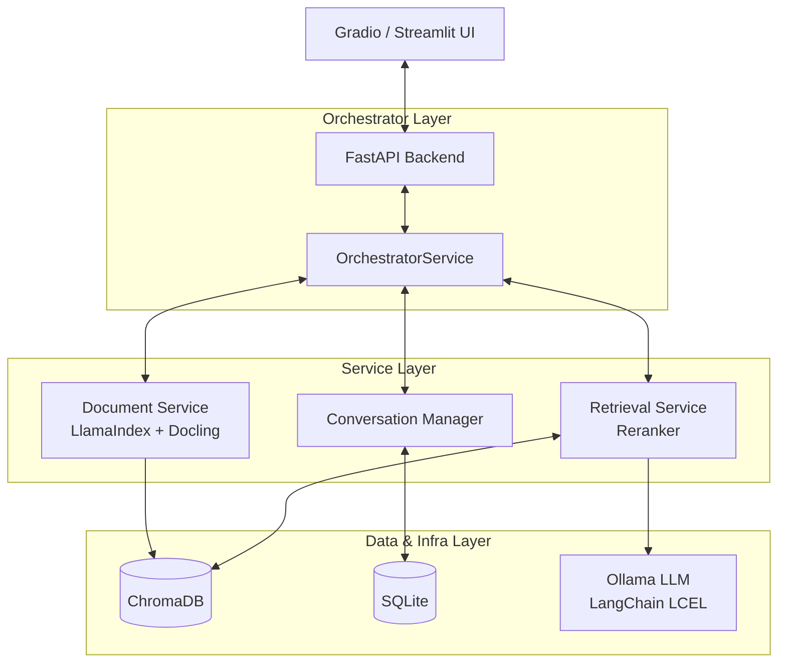

# RAG Research Assistant

A privacy-centric, locally deployed Retrieval-Augmented Generation (RAG) system designed for secure and intelligent conversations with personal or organizational documents. Powered by **LlamaIndex**, **LangChain**, **Docling**, and **Ollama**.

[](https://www.python.org/downloads/) [](https://fastapi.tiangolo.com/) [](https://ollama.ai/) [](https://www.llamaindex.ai/) [](https://www.langchain.com/) [](https://github.com/DS4SD/docling) [](https://streamlit.io/)

---

## 🌟 Overview

The RAG Research Assistant provides a secure framework for context-aware conversations with your documents using state-of-the-art retrieval and generation techniques. The system is designed for complete local execution, ensuring that **no data leaves your host environment**.

### Core Architecture

The system pipeline is built on robust modern tooling:

1. **Intelligent Ingestion (`Docling` & `LlamaIndex`)**: Uses IBM's Docling (with Apple Silicon MPS acceleration) to parse complex PDFs into Markdown, then chunks them logically using `MarkdownNodeParser`.
2. **High-Quality Retrieval (`ChromaDB`)**: Embeds chunks using `BAAI/bge-large-en-v1.5` and performs vector search with dynamic GPU support (CUDA/MPS/CPU).
3. **Re-ranking**: Boosts the most relevant context using `SentenceTransformerRerank` before sending it to the LLM.
4. **LLM Generation (`LangChain` & `Ollama`)**: Produces grounded responses based on the retrieved context utilizing LangChain's Expression Language (LCEL) connected to your local model of choice (e.g., `ollama3.2`).
5. **Conversation Memory**: Manages state and context using a custom SQLModel implementation on top of SQLite.

---

## ✨ Key Features

| Feature | Description |
| --------- | ------------- |
| **Data Privacy** | 100% local execution. No cloud APIs, no data leaks. |
| **Advanced Parsing** | Docling integration allows for superior parsing of tables, equations, and complex PDF layouts. |
| **Hardware Acceleration** | Automatically detects and utilizes NVIDIA CUDA or Apple Silicon MPS for rapid embeddings and reranking. |
| **LlamaIndex & LangChain** | Robust vector indexing via LlamaIndex combined with LangChain's prompt templating and chains. |
| **Dual UI Options** | Run the app via a polished **Streamlit** dashboard or a quick **Gradio** chat interface. |
| **Context Management** | Automatic sliding-window conversation memory stored in SQLite. |

---

## 🏗️ System Architecture



### Project Structure

```bash
rag-research-assistant/
├── src/
│   ├── api/              # FastAPI routes and REST schemas
│   ├── config/           # Configuration, settings, hardware device detection
│   ├── conversation/     # SQLite chat history and sliding-window context
│   ├── documents/        # Docling parsing and MarkdownNode chunking
│   ├── infra/
│   │   ├── db/          # SQLite session management
│   │   ├── embeddings/  # HuggingFaceEmbedding (BGE-Large)
│   │   ├── llm/         # Ollama LLM wrapper powered by LangChain
│   │   └── vectorstore/ # LlamaIndex ChromaDB integration
│   ├── retrieval/       # Search logic & SentenceTransformer Reranking
│   ├── orchestrator/    # Main business logic coordinator
│   └── utils/           # Logging and utilities
├── ui/
│   ├── gradio_app.py    # Gradio-based UI
│   └── streamlit_app.py # Streamlit-based UI (Recommended)
├── data/                # Local storage for SQLite, documents, and ChromaDB
├── requirements.txt
└── README.md
```

---

## 🚀 Installation and Setup

### Prerequisites

- **Python 3.11+**
- **Ollama**: Installed and running locally ([Download](https://ollama.ai/download))
- **uv** (Recommended) or **conda/pip** for dependency management.

### 1. Environment Setup

```bash
# Clone the repository
git clone https://github.com/dsbarik/rag-research-assistant.git
cd rag-research-assistant

# If using conda + uv (Recommended)
conda create -n torch-env python=3.11
conda activate torch-env
uv pip install -r requirements.txt
```

### 2. Model Deployment

```bash
# Pull the required LLM model (can be changed in settings)
ollama pull gemma4:31b-cloud

# Verify model is running
ollama list
```

### 3. Running the App

You need to run the **Backend API** and your choice of **UI**.

**Terminal 1: Backend API**

```bash
fastapi dev src/api/main.py
```

*(API runs at `http://localhost:8000/docs`)*

**Terminal 2: Streamlit Interface (Recommended)**

```bash
streamlit run ui/streamlit_app.py
```

*(App runs at `http://localhost:8501`)*

**Alternative UI: Gradio**

```bash
python ui/gradio_app.py
```

*(App runs at `http://localhost:7860`)*

---

## 📖 Usage Guide

1. **Ingest Documents**: Open the UI sidebar, upload your PDF/TXT files, and hit "Ingest". The backend will use Docling to parse the document, LlamaIndex to chunk it, and BGE-Large to embed it into ChromaDB.
2. **Chat**: Use the main chat interface to ask questions. The system will search the vector store, rerank the best matches, and stream the context to Ollama.
3. **Manage Knowledge**: View and delete uploaded documents directly from the sidebar. If you upload a document with the same name, be sure to delete the existing one first to avoid a `FileExistsError`.
4. **New Chat**: Click the "New Chat" button to clear the sliding-window memory and start a fresh context.

---

## ⚙️ Configuration

To change system defaults (like the embedding model or LLM), modify `src/config/settings.py`:

```python
# Default models
LLM_MODEL_NAME = "gemma4:31b-cloud" 
EMBEDDING_MODEL = "BAAI/bge-large-en-v1.5"

# Hardware Acceleration
# The system dynamically auto-selects 'cuda', 'mps', or 'cpu' 
# using PyTorch device checks.
```

*Note: If you change the embedding model, you must wipe the `./data/vector_store` directory as vector dimensions will change.*

---

## 🛠️ Troubleshooting

| Issue | Resolution |
| --- | --- |
| **Connection Refused** | Ensure the Ollama service is running via `ollama serve`. |
| **Ingestion is Slow** | Docling uses advanced OCR and structure parsing. On Macs, it utilizes MPS acceleration automatically, but large PDFs may still take time. |
| **FileExistsError on Upload** | The system prevents silent overwrites. If you want to update a document, you must delete the existing document using the UI first before re-uploading. |
| **Poor Answers** | Ensure you have actually ingested the document. Check the `Managed Documents` list in the UI. |

---

## 🤝 Contributing

Contributions are welcome!

1. Fork the repository.
2. Create a feature branch: `git checkout -b feature/amazing-feature`.
3. Commit changes: `git commit -m 'Add amazing feature'`.
4. Push to the branch and open a Pull Request.

---

## 📜 License

This project is licensed under the MIT License. See the [LICENSE](LICENSE) file for details.

---

## 🙏 Acknowledgments

- **[LlamaIndex](https://www.llamaindex.ai/)**: The premier framework for data-aware LLM applications.
- **[LangChain](https://www.langchain.com/)**: Building block framework for LLM templating and orchestration.
- **[Docling](https://github.com/DS4SD/docling)**: IBM's incredible document parsing tool.
- **[Ollama](https://ollama.ai/)**: Frictionless local LLM inference.
- **[ChromaDB](https://www.trychroma.com/)**: High-performance local vector database.
